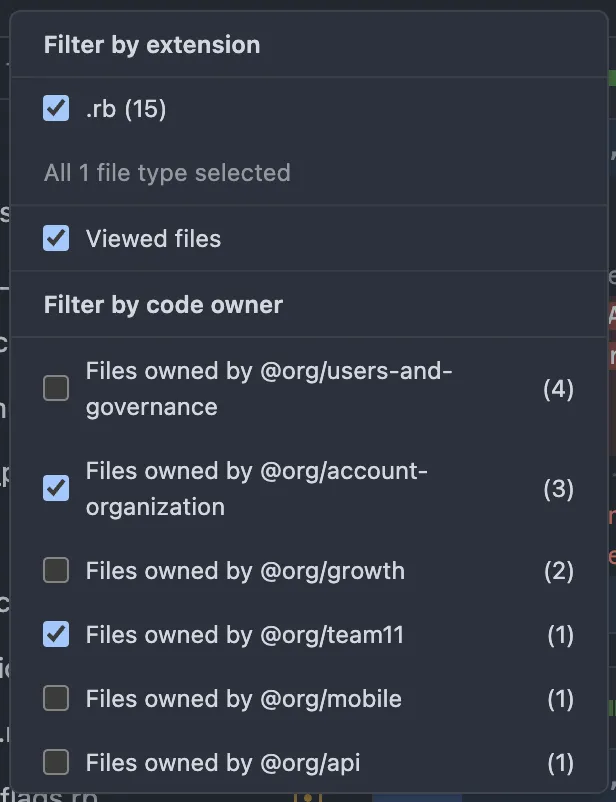

# GitHub Code Owners Filter

A Chrome extension that enhances GitHub's pull request file view by adding the ability to filter files by code owners.



## Features

- 🔍 Filter files by code owner in pull request views
- 🚀 Works automatically on GitHub pull request file pages
- 🎯 Shows file count per code owner
- ⚡ Real-time filtering without page reload
- 🔄 Dynamically updates when new files are loaded
- 🎨 Seamlessly integrates with GitHub's native UI

## Installation

### From Chrome Web Store

1. Visit the [Chrome Web Store](https://chrome.google.com/webstore) (link to be added)
2. Click "Add to Chrome"
3. Click "Add Extension" in the popup

### From Source

1. Clone this repository

```bash
git clone https://github.com/yourusername/github-codeowners-filter.git
```

2. Open Chrome and navigate to `chrome://extensions/`
3. Enable "Developer mode" in the top right
4. Click "Load unpacked" and select the extension directory

## Usage

1. Navigate to any pull request's "Files changed" tab on GitHub
2. Click the file filter button (usually located above the file list)
3. You'll see a new "Filter by code owner" section
4. Select one or more code owners to filter the file list
5. Files will be filtered in real-time based on your selection

## How It Works

The extension:

1. Detects when you're viewing a pull request's files
2. Scans the page for files with code ownership information
3. Creates a filterable list of all code owners
4. Adds a new section to GitHub's native file filter menu
5. Handles filtering through GitHub's existing UI patterns

## Development

### Prerequisites

- Node.js (v14 or higher recommended)
- npm or yarn
- Chrome browser

### Setup

1. Clone the repository
2. Install dependencies

```bash
npm install
```

### Building

```bash
npm run build
```

### Testing

```bash
npm test
```

### Development Mode

1. Build the extension
2. Load it into Chrome as an unpacked extension
3. Make changes to the code
4. Click the refresh button in `chrome://extensions/` to see your changes

## Contributing

Contributions are welcome! Please feel free to submit a Pull Request.

1. Fork the repository
2. Create your feature branch (`git checkout -b feature/AmazingFeature`)
3. Commit your changes (`git commit -m 'Add some AmazingFeature'`)
4. Push to the branch (`git push origin feature/AmazingFeature`)
5. Open a Pull Request

## Technical Details

- Written in TypeScript
- Uses MutationObserver to detect DOM changes
- Integrates with GitHub's native UI components
- Zero external dependencies
- Lightweight and performance-focused

## Privacy

This extension:

- Does not collect any user data
- Does not make any network requests
- Only runs on GitHub pull request pages
- Only reads code ownership information that's already visible on the page

## License

Distributed under the MIT License. See `LICENSE` for more information.

## Support

If you encounter any problems or have feature requests, please:

1. Check the existing issues
2. Open a new issue if your problem/request isn't already tracked
